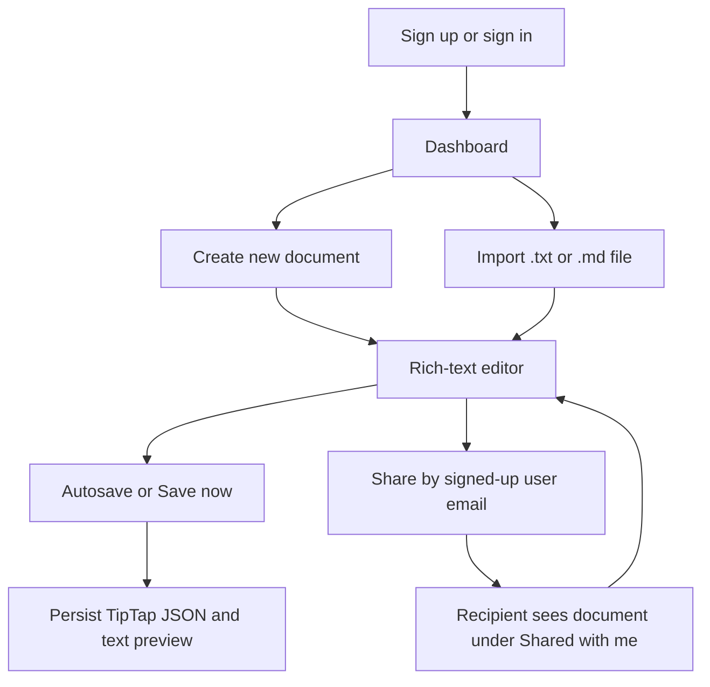
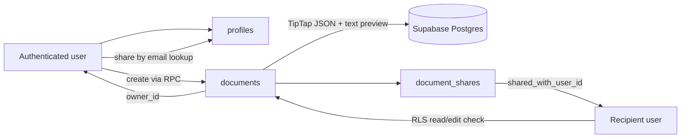
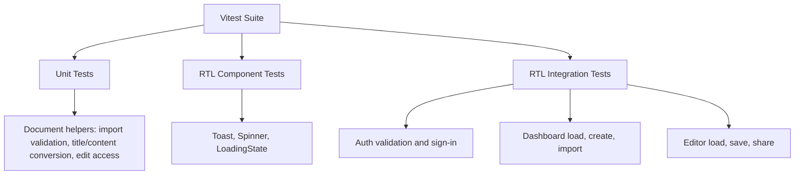

# Architecture Note

## Product Slice

DraftSpace focuses on the smallest coherent collaborative document workflow: a reviewer can create an account, create or import a document, edit rich text, save it, share it with another signed-up user, and see owned versus shared documents separately.

I prioritized end-to-end product behavior over Google Docs breadth. The MVP intentionally skips real-time collaboration, comments, version history, exports, and granular role management so the core creation, editing, persistence, file handling, and sharing paths are easier to evaluate.

## MVP Differentiators

This MVP is not trying to clone Google Docs feature-for-feature. The product bet is a lightweight team drafting space with a few reliable workflows:

- A clean owned/shared workspace instead of a full file tree.
- Text and Markdown import as a first-class way to turn existing notes into editable documents.
- TipTap JSON persistence so formatting survives refreshes without storing fragile editor HTML.
- Simple email-based sharing backed by Supabase RLS, so access is enforced by the database and not only by client-side UI checks.
- Visible scope notes in the product so reviewers understand what was intentionally left out.

## User Flow

## Frontend

The app uses Next.js App Router with client-side Supabase auth calls. The landing page handles sign-in/sign-up and routes authenticated users to the dashboard.

The dashboard loads owned documents and share grants, then fetches the documents shared with the current user. It also owns the `.txt`/`.md` import workflow and creates imported content as new editable documents.

The document editor is built with TipTap. Content is stored as TipTap JSON so formatting survives refreshes, while a plain-text copy is stored for dashboard previews.

## Backend And Persistence

Supabase provides auth, Postgres persistence, and row level security. The schema includes:

- `profiles` for share lookup by email.
- `documents` for owned document records, TipTap JSON content, plain-text previews, and timestamps.
- `document_shares` for granting another user access to a document.

RLS policies allow users to read owned or shared documents, edit documents they own or have editor access to, and manage share grants only for documents they own.

## Data And Access Flow

## Sharing Model

Sharing is intentionally simple: document owners grant editor access by entering another signed-up user's email address. The dashboard distinguishes "Owned documents" from "Shared with me," and the editor shows whether the current user owns the document or is using shared editor access.

## Quality Bar

The app includes basic validation and error handling around auth, missing documents, unsupported imports, file size, and missing share recipients. Automated tests cover helper logic, shared UI feedback components, auth form validation/sign-in behavior, dashboard create/import paths, and document editor save/share behavior.

## Test Strategy

The tests mock Supabase and TipTap at the integration boundary so they can verify application behavior without requiring live network calls or a browser editor runtime. Live Supabase behavior is still covered by manual smoke testing because RLS and auth depend on the deployed project configuration.
